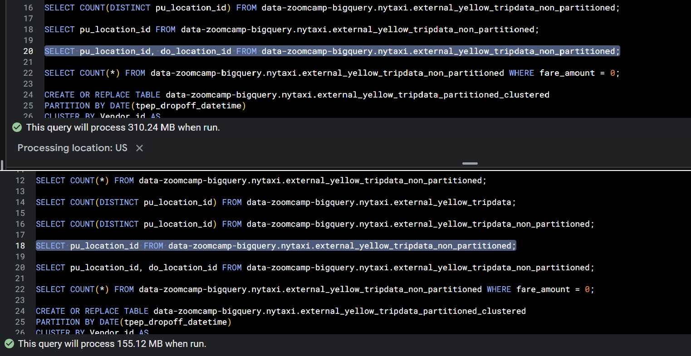
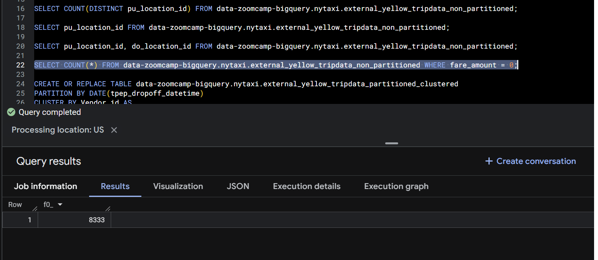
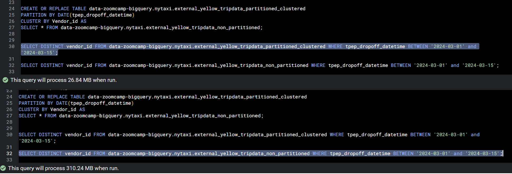

# Homework 3 results

## 1. What is count of records for the 2024 Yellow Taxi Data?


## 2. Write a query to count the distinct number of PULocationIDs for the entire dataset on both the tables. What is the estimated amount of data that will be read when this query is executed on the External Table and the Table?


## 3. Write a query to retrieve the PULocationID from the table (not the external table) in BigQuery. Now write a query to retrieve the PULocationID and DOLocationID on the same table. Why are the estimated number of Bytes different?



## 4. How many records have a fare_amount of 0?



## 5. What is the best strategy to make an optimized table in Big Query if your query will always filter based on tpep_dropoff_datetime and order the results by VendorID (Create a new table with this strategy)

```sql
CREATE OR REPLACE TABLE data-zoomcamp-bigquery.nytaxi.external_yellow_tripdata_partitioned_clustered
PARTITION BY DATE(tpep_dropoff_datetime)
CLUSTER BY Vendor_id AS
SELECT * FROM data-zoomcamp-bigquery.nytaxi.external_yellow_tripdata_non_partitioned;
```

## 6. Write a query to retrieve the distinct VendorIDs between tpep_dropoff_datetime 2024-03-01 and 2024-03-15 (inclusive). Use the materialized table you created earlier in your from clause and note the estimated bytes. Now change the table in the from clause to the partitioned table you created for question 5 and note the estimated bytes processed. What are these values?



## 7. Where is the data stored in the External Table you created?

R// GCP Bucket

## 8. It is best practice in Big Query to always cluster your data:

R// False
