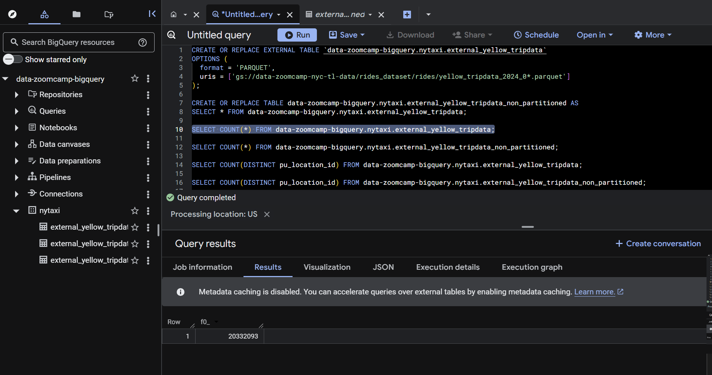
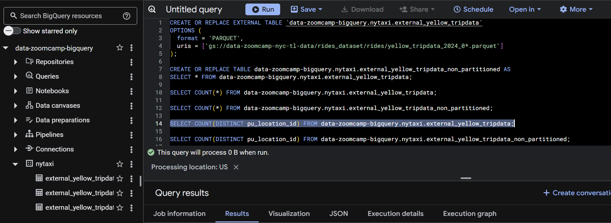
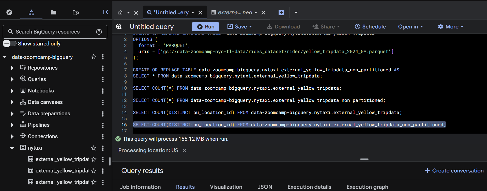

# Homework 3 results

## 1. What is count of records for the 2024 Yellow Taxi Data?

## 2. Write a query to count the distinct number of PULocationIDs for the entire dataset on both the tables. What is the estimated amount of data that will be read when this query is executed on the External Table and the Table?

